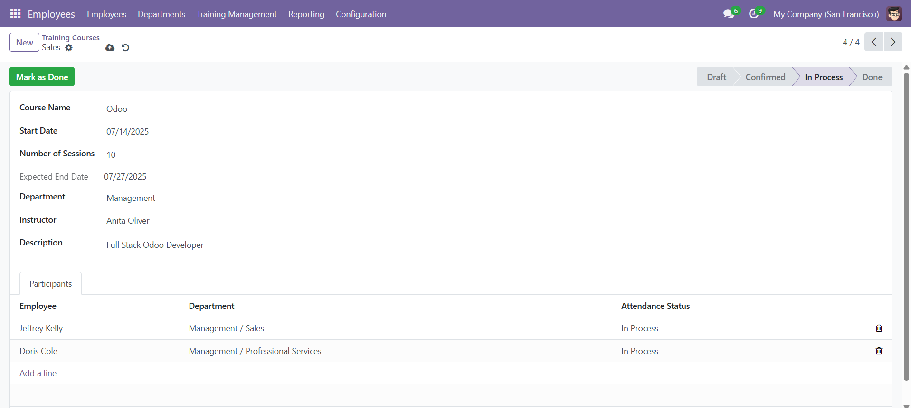
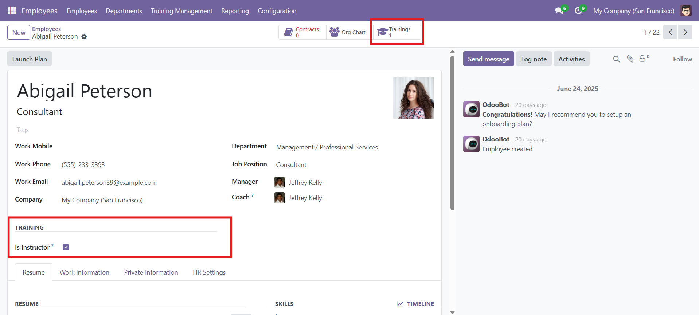
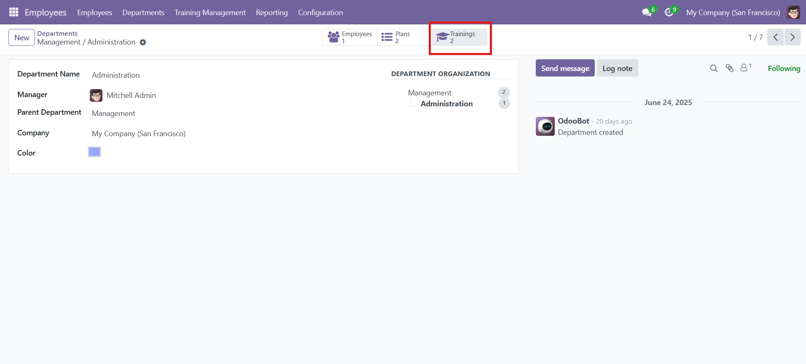

# 🏫 HR Training Management Module

This custom Odoo 17 module helps manage internal employee training sessions. It integrates with the **HR** app and provides a complete workflow from creating training courses to tracking participation and attendance.

---

## 📷 Screenshots

<div align="center">
  
  <br/>
  <em>Training Course Form View</em>
</div>

<br/>

<div align="center">
  
  <br/>
  <em>Employee Smart Button to View Participations</em>
</div>

<br/>

<div align="center">
  
  <br/>
  <em>Department View with Training Courses Stats</em>
</div>

---

## 📦 Features

- Create training courses linked to departments.
- Assign instructors (employees with a checkbox "Is Instructor").
- Set training start date and number of sessions — automatically calculate expected end date (excluding Fridays and Saturdays).
- Track participant attendance: `Registered`, `In Process`, `Attended`, `Absent`.
- Smart buttons on **employee** and **department** forms for quick navigation to related training data.
- Training workflow: `Draft → Confirmed → In Process → Done`.

---

## 🧩 Models

| Model | Description |
|-------|-------------|
| `hr.training.course` | Stores training course info (name, dates, instructor, etc.) |
| `hr.training.participation` | Stores participation info per employee/course |
| Inherited: `hr.employee` | Adds instructor flag and smart button |
| Inherited: `hr.department` | Tracks number of training courses and participations |

---

## 🧪 Workflow Example

1. **Create a Course**
   - Define course name, department, instructor, start date, and number of sessions.

2. **Add Participants**
   - Add employees to the `Participants` tab.

3. **Advance the Workflow**
   - Draft → Confirm → Start Training → Done
   - Attendance status.

---

## 🧰 Technical Details

### Dependencies

- `base`
- `hr`

### Views

- Form and tree views for:
  - Training Courses
  - Training Participations
- Inherited views for:
  - Employee Form (`hr.employee`)
  - Department Form (`hr.department`)

### Smart Buttons

- **Employee**: Shows training participations.
- **Department**: Shows all training courses related to the department.

---

## 🗂️ Folder Structure

```text
hr_training/
├── __manifest__.py
├── models/
│   ├── training_course.py
│   ├── training_participation.py
│   ├── hr_employee.py
│   └── hr_department.py
├── views/
│   ├── training_course_views.xml
│   ├── training_participation_views.xml
│   ├── hr_employee_views.xml
│   └── hr_department_views.xml
├── security/
│   └── ir.model.access.csv
```

---

## ▶️ Installation

1. Place the module inside your `custom_addons` folder.
2. Restart Odoo.
3. Activate **Developer Mode**.
4. Go to **Apps** → Click **Update App List**.
5. Search for **HR Training Management** and click **Install**.

---

> Feel free to improve or contribute to this module by forking the repository!
